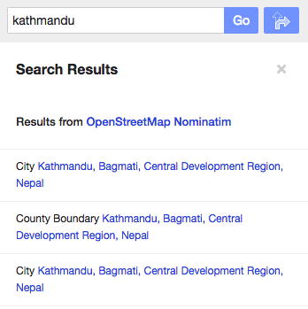
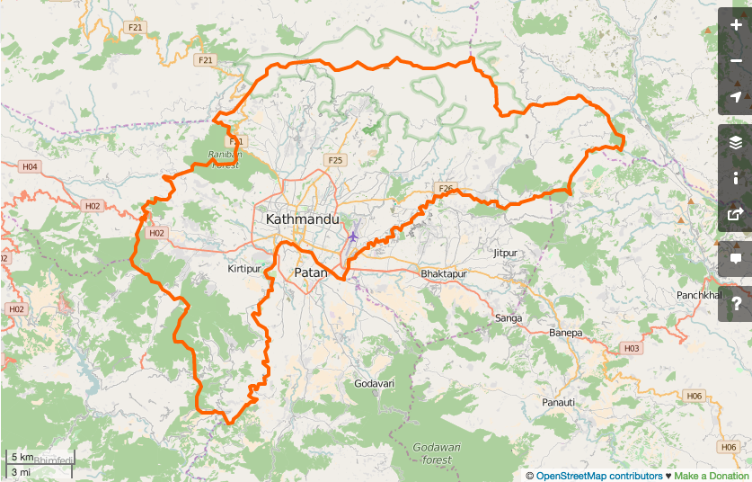
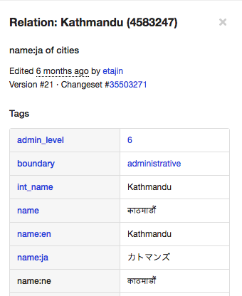
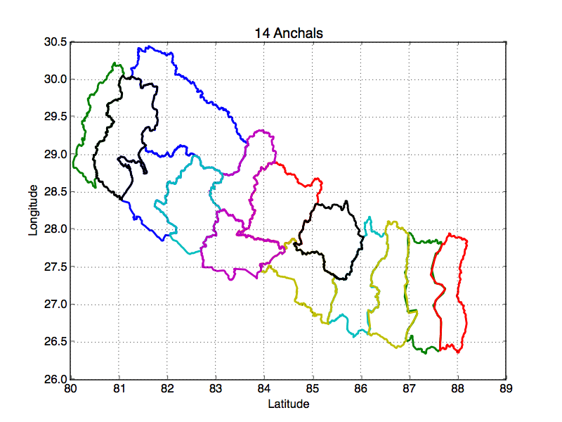
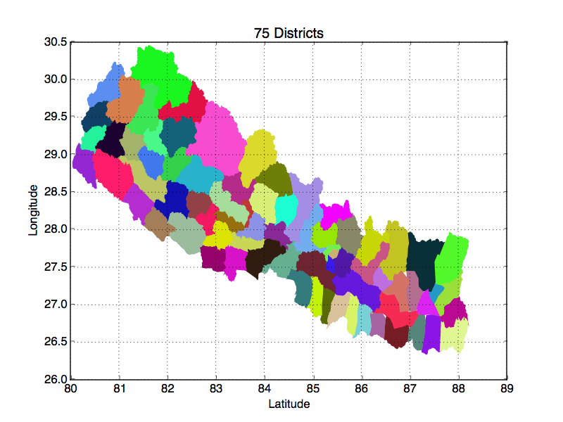

## mapNepal
This is an attempt to generate map of different boundries within Nepal. There are 14 anchals, 75 districts and I'd like to be able to create a map myself without having to search in google. I am also interested in knowing about interesting features (how population varies between cities, how economic prosperity of a place depends on the proximity to Kathmandu, river+road networks, etc).

To that end, one could download osm data from http://download.geofabrik.de/ and extract boundaries from osm data. However, I found that cumbersome. There's a lot of things that I would need to install before I could get the geo-location of nodes that I am interested in. Instead, I use overpass API to directly download the osm file for a specific node that I am interested in. For a given node (say, district of Kathmandu), one would have to go through following steps:

## Steps

0. Go to openstreetmap: https://www.openstreetmap.org/ and enter Kathmandu 

1. Click on the node for the district of Kathmandu 

3. You can now see the node number (nodeNum) associated with the District of Kathmandu  

4. From your terminal, enter 'wget -O nodeNum.osm "http://overpass-api.de/api/interpreter?data=(rel(nodeNum);>);out;";'

5. You get .osm file which needs to be converted to a poly file, which then needs to be cleaned up further.

Just like the district of Kathmandu, osm file can be downloaded for other districts. Having known what the nodeNum is for each district, this process can be automated. To get poly files for all districts, do ' bash anchalBoundaries.sh'
from your terminal. Now, if you have root installed in your machine, 'root -l graphAnchals.C' ( Or, equivalently,  'python graphAnchals.py')generates the plot for 14 anchals.

